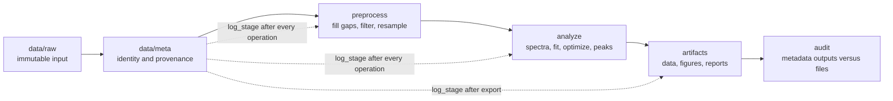

# precision-physkit architecture

`precision-physkit` is a Python toolkit for reproducible precision-measurement data
processing. The import package is `precision_physkit`; performance-critical LPSD
and linear-algebra routines are provided by `precision_physkit._core`.

## Repository layout

| Path | Purpose |
|---|---|
| `src/precision_physkit/` | Python package: metadata, preprocessing, filters, spectra, fitting, optimization, peaks, and plotting |
| `rust/src/` | Rust extension implementation |
| `tests/` | Python test suite |
| `rust/src/tests.rs` | Rust tests |
| `docs/` | Architecture, user guide, and API reference |
| `examples/` | Executable examples |
| `data/raw/` | Immutable source observations |
| `data/meta/` | One schema-1 TOML record per dataset |
| `artifacts/data/` | Derived machine-readable outputs |
| `artifacts/figures/` | Publication and preview figures |
| `artifacts/reports/` | Human-readable summaries |
| `reference/` | Curated reference snapshots used for comparison |

Do not import from historical or archived implementations. Public code must import
from `precision_physkit`.

## Processing model



1. Store an acquired dataset in `data/raw/`; never overwrite it.
2. Create `data/meta/<name>.meta.toml` with `meta.create_meta`, then record
   acquisition with `meta.log_stage`.
3. Preprocess in a defensible order. A common time-series chain is gap filling,
   task-specific anti-alias filtering, then downsampling. Log every operation.
4. Run the required analyses and record estimator parameters, software version,
   random seeds, and outputs.
5. Write derived files only below `artifacts/`. Use the same `NN_` prefix for
   related data, figures, and reports.
6. Audit with `meta.load_meta(path)["processing"]`; recorded output paths must
   match the files on disk.

## Metadata contract

Schema 1 answers four questions:

- **Identity:** UUID, human-readable name, and UTC creation time.
- **Source:** instrument, experiment, operator, and description.
- **Contents:** files, format, sample rate, sample count, time range, and channels.
- **History:** append-only processing entries containing stage, fully qualified
  tool name, tool version, TOML-compatible parameters, timestamp, and outputs.

Every dataset must have metadata. Missing `log_stage` entries break provenance.
`save_meta` and `load_meta` validate the schema and reject invalid documents.

## Installation and verification

For a clean clone, install the locked environment:

```bash
uv sync --locked
```

If a lock file has not yet been generated, use `uv sync` once to resolve the
environment, then commit and use the resulting lock file for reproducible builds.

Run the Python and Rust suites with:

```bash
uv run pytest -q
uv run cargo test --manifest-path rust/Cargo.toml --locked
```

## Maintenance contract

When public behavior changes:

1. update `src/precision_physkit/` and, if needed, `rust/src/`;
2. run the relevant tests, then both full commands above;
3. update the matching `docs/api/api-*.md` signatures, defaults, constraints,
   return structures, and numerical conventions;
4. rerun affected examples and compare appropriate outputs with `reference/`;
5. update versions consistently when the change is user-visible.

See [the user guide](user-guide.md) for workflows and [the API index](api/api-pipeline.md)
for the end-to-end contract.
